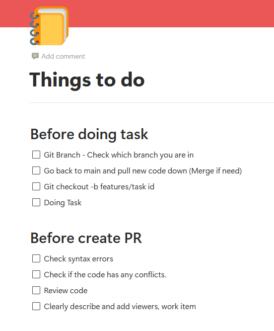

# STAGE
terraform init -backend-config="bucket=ss-apolloware-terraform-non-prod-artifacts"
terraform workspace list
terraform workspace select infrastructure-stage
terraform plan -var-file terraform-stage.tfvars
arn:aws:iam::804628476267:role/stage-apolloware-terraform-infrastructure-pipeline-assume-role

# PROD
terraform init -backend-config="bucket=ss-apolloware-terraform-prod-artifacts"
terraform workspace list
terraform workspace select infrastructure-prod
terraform plan -var-file terraform-prod.tfvars
arn:aws:iam::362522740583:role/prod-apolloware-terraform-infrastructure-pipeline-assume-role

# git checkout master
# Switched to branch 'master'
# Your branch is up to date with 'origin/master'.

# git checkout -b A27-3025 để 

